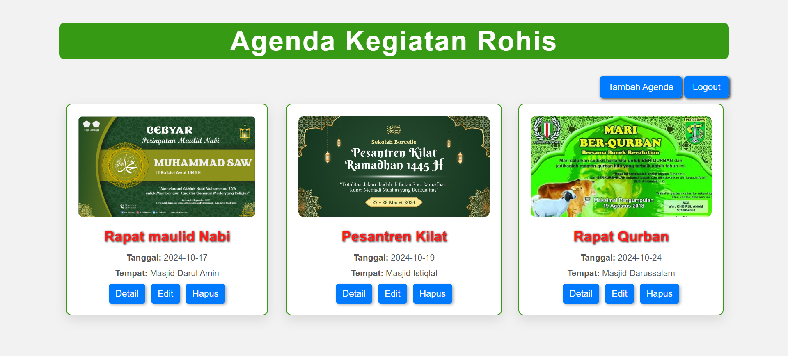
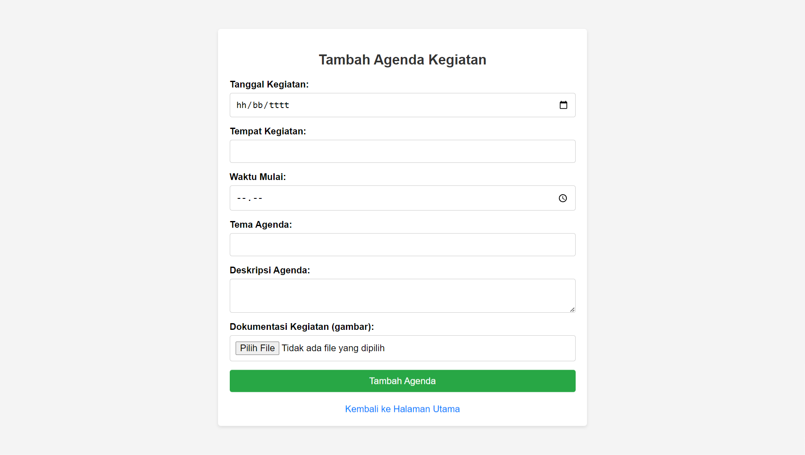
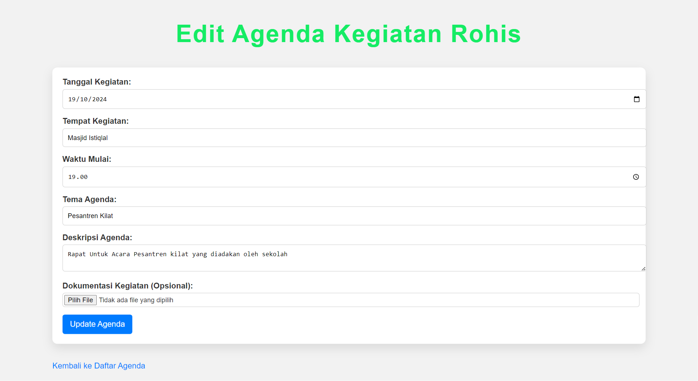
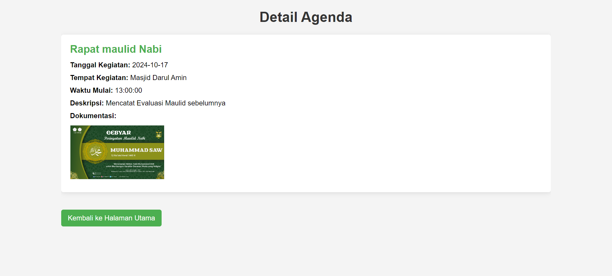

# 🕌 Aplikasi Agenda Kegiatan Rohis 📅

Selamat datang di **Aplikasi Agenda Kegiatan Rohis**! 🎉  
Aplikasi ini membantu mencatat dan mengelola agenda kegiatan Rohis dengan mudah dan praktis. Semua kegiatan penting tercatat rapi sehingga lebih mudah dipantau. 📝

## 🚀 Fitur Utama

- **Agenda Kegiatan**: Lihat daftar agenda kegiatan Rohis yang tersedia.
- **Tambah Agenda**: Pengguna dapat menambahkan kegiatan baru ke dalam agenda.
- **Edit dan Hapus Agenda**: Edit atau hapus kegiatan yang sudah ada dengan mudah.
- **Tampilan Interaktif**: Antarmuka yang sederhana dan responsif untuk kenyamanan pengguna.

## 📚 Teknologi yang Digunakan

Aplikasi ini dibangun menggunakan beberapa teknologi berikut:

- **HTML5**: Untuk struktur halaman aplikasi.
- **CSS3**: Untuk styling yang membuat aplikasi tampak menarik dan enak dipandang.
- **PHP**: Digunakan untuk logika backend aplikasi dan pengelolaan data agenda.
- **MySQL**: Sebagai database untuk menyimpan data agenda kegiatan Rohis.

## 💻 Dokumentasi

### Halaman Utama
Pada halaman utama, pengguna dapat melihat semua agenda kegiatan yang tersedia. Tampilan diatur dalam bentuk kartu (card) yang rapi dan menarik.

### Halaman Tambah Agenda
Pengguna dapat menambahkan agenda baru beserta detail kegiatan yang diperlukan, seperti judul, deskripsi, tanggal, waktu, dan lainnya.

### Halaman Edit Agenda
Di halaman ini, pengguna dapat memperbarui informasi kegiatan yang sudah ada, mengubah detail agenda sesuai kebutuhan.

### Halaman Detail Agenda
Pengguna dapat melihat detail lengkap agenda kegiatan Rohis yang dipilih.

---

# 🙏🏻 Terima Kasih Sudah Menggunakan Aplikasi Ini 🙏🏻

Semoga aplikasi ini memudahkan Anda dalam mengelola kegiatan Rohis! Jangan lupa untuk mendukung kami dengan **like** dan **share**! 😊
